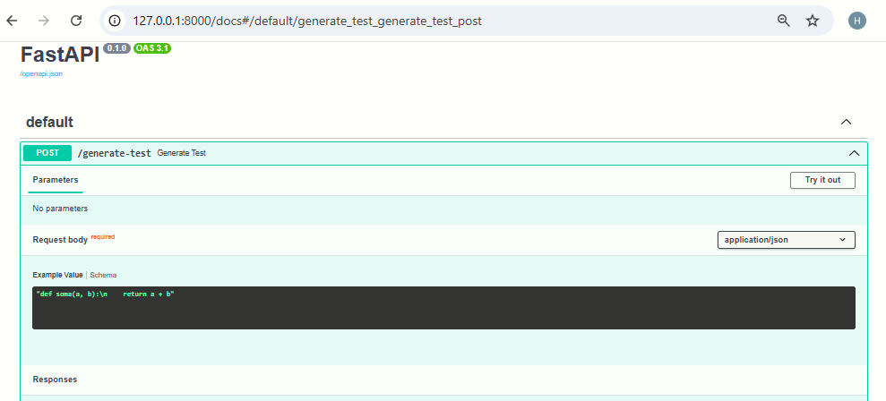

# TDD com LangChain e Azure ChatGPT

Este projeto utiliza LangChain com Azure ChatGPT para automatizar a geração de testes unitários a partir de funções Python. A aplicação foi desenvolvida com FastAPI, permitindo o envio de código via API e recebendo como resposta os testes gerados automaticamente. É uma solução prática para aplicar TDD com IA no desenvolvimento Python.

## 🚀 Funcionalidade

- Recebe uma função Python como entrada
- Retorna um teste unitário correspondente, gerado pela LLM (ChatGPT da Azure via LangChain)

## 🛠 Tecnologias

- Python
- FastAPI
- LangChain
- Azure OpenAI
- Uvicorn
- Requests
- .env + python-dotenv

## 📦 Instalação

```bash
git clone https://github.com/seu-usuario/TDD_LangchainChatGPT.git
cd TDD_LangchainChatGPT
pip install -r requirements.txt

Crie um arquivo .env com:
AZURE_OPENAI_API_KEY=xxxxxxxxxxxx
AZURE_OPENAI_ENDPOINT=https://xxxxxx.openai.azure.com/
AZURE_OPENAI_API_VERSION=2023-07-01-preview
AZURE_OPENAI_DEPLOYMENT_NAME=gpt35turbo16k


▶️ Executando

uvicorn app.langchain_agent:app --reload


📩 Exemplo de Requisição

POST /generate-test
```
{
  "code": "def soma(a, b):\n    return a + b"
}
```


Resposta:

```
{
  "test_code": "def test_soma():\n    assert soma(2, 3) == 5\n    assert soma(-1, 1) == 0"
}
```


# 📸 Print da API funcionando



